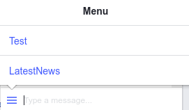

# fb-persistent-menu

> CLI tool that adds or removes "Persistent menu" (on Messenger) from Facebook page

### :warning: Prerequisites

* The person must be running Messenger v106 or above on iOS or Android.
* The Facebook Page the Messenger bot is subscribed to must be published.
* The Messenger bot must be set to "public" in the app settings.
* The Messenger bot must have the pages_messaging permission.

### :computer: Installation

    npm install -g fb-persistent-menu

### :arrow_right: Usage

* add menu - settings are in JSON format

`fb-persistent-menu --token <PAGE_ACCESS_TOKEN> --settings '<MENU>'`

* remove menu

`fb-persistent-menu --token <PAGE_ACCESS_TOKEN> --remove`

`fb-persistent-menu --token <PAGE_ACCESS_TOKEN> -r`

### :rocket: Demo



```
fb-persistent-menu --token <PAGE_ACCESS_TOKEN> --settings '{
  "persistent_menu": [
    {
      "locale": "default",
      "call_to_actions": [
        {
          "type": "postback",
          "title": "Test",
          "payload": "TEST_PAYLOAD"
        },
        {
          "type": "web_url",
          "title": "Latest News",
          "url": "https://news.ycombinator.com/",
          "webview_height_ratio": "full"
        }
      ]
    }
  ]
}'
```
